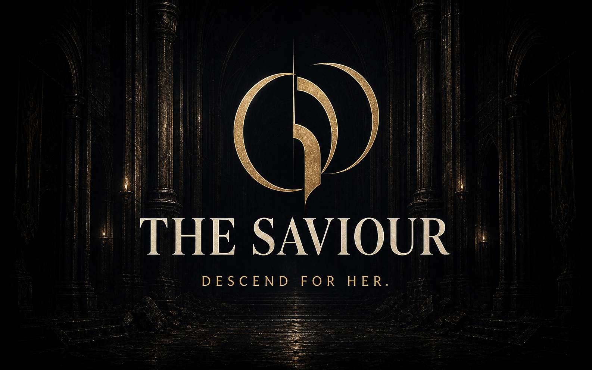

<p align="center">
  
</p>

**Ten floors into the dark. One princess to bring home.**<br>
Browser action roguelite · Three.js · Keyboard, mouse, controller, and touch

Princess Elowen has vanished beneath the kingdom. Guided by the pull of their paired rings, Prince Zephyr follows with scythe in hand. To reach her, he must fight through ten ever-changing floors, forge a powerful build, and survive whatever waits in the depths.

## The descent

Every run is a fast, build-driven journey through ten increasingly dangerous floors.

- Clear three generated combat chambers on each floor.
- Recover health automatically after a cleared chamber, then enter its portal immediately.
- On floors 1–5, swear one of three Oaths for a new core technique.
- On floors 6–9, master one of your five owned Oaths to Rank II.
- Adapt to new biomes, enemy combinations, and volatile variants.
- Reach the depths and face what waits there.

Choose **New Descent** for the complete story with your preferred difficulty, or **Speedrun** for a fixed Ruthless run with a dedicated timer and separate records.

## Fight with the scythe

Stay aggressive to build **Harvest** through close-range hits, critical strikes, kills, perfect charges, and Perfect Dashes. A Perfect Dash means starting a dash just before an enemy attack connects. The meter holds three segments; spend a filled segment on **Grave Line** or **Reaper's Claim**.

| Technique | Input | How it works |
| --- | --- | --- |
| **Scythe combo** | Tap `Left Mouse` | Chain three wide sweeps. Time repeated taps to continue through the full combo. |
| **Grave Line** | Hold `Left Mouse` | Charge a devastating straight-line strike. It costs one Harvest segment, allows one dash while charging, and fires automatically at full power. |
| **Charged Reap** | Hold `Q` or `Middle Mouse` | Charge and release a full-circle attack to clear space around Zephyr. |
| **Reaper's Claim** | Press `R` | Spend one Harvest segment to throw the scythe through enemies and recall it. Tap attack as it returns to turn the catch into a powerful cleave. |
| **Dash strike** | Attack during a dash | Carry Zephyr's attack through his movement and cut across the path ahead. |

## Controls

| Action | Keyboard and mouse |
| --- | --- |
| Move | `WASD` or arrow keys |
| Aim | Mouse |
| Dash | `Shift`, `Space`, or `Right Mouse` |
| Enter the next chamber | Walk into the center portal |
| Navigate menus | `WASD` or arrow keys; `Space`, `Enter`, or `E` to select |
| Pause | `Escape` |

Bindings can be changed in **Settings**. Controller and touch controls are also supported.

## Download and play

The game runs locally in your browser. Install [Node.js 22.12 or newer](https://nodejs.org/) first; Node.js includes `npm`, which handles the game’s setup.

### Download the ZIP

1. Click the green **Code** button at the top of this repository and choose **Download ZIP**.
2. Extract the ZIP, then open the extracted game folder.
3. Open a terminal in that folder. In VS Code, use **Terminal → New Terminal**.
4. Install the game’s dependencies and start it:

```bash
npm install
npm run dev
```

5. Open [http://127.0.0.1:5173/](http://127.0.0.1:5173/) in your browser. If that port is busy, use the address printed in the terminal instead.

### Or clone with Git

```bash
git clone https://github.com/CipherAtlas/The-Saviour.git
cd The-Saviour
npm install
npm run dev
```

After the first setup, you only need to open a terminal in the game folder and run `npm run dev`. Press `Ctrl+C` in the terminal when you want to stop the local server.
